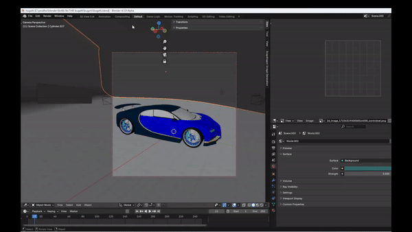
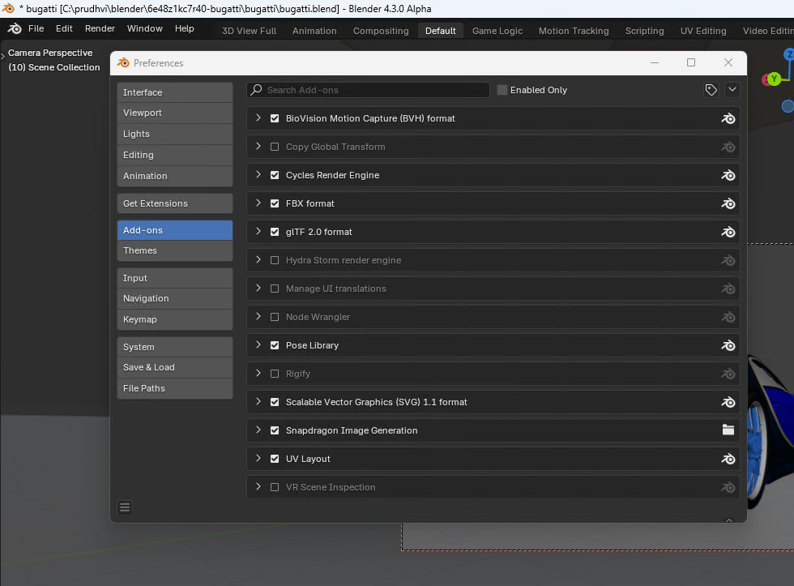

#  Blender ControlNet Plugin

Blender ControlNet plugin runs on Qualcomm X-Elite NPU using [Qualcomm AI Runtime (QAIRT) SDK](https://www.qualcomm.com/developer/software/qualcomm-ai-engine-direct-sdk). The plugin uses QAIRT python APIs to run context binaries (.bin) generated by QAIRT SDK. We provide optimal performance by using QAIRT to run AI models on Qualcomm X-Elite NPU. These models are hosted on [Qualcomm AI hub](https://aihub.qualcomm.com/models/controlnet_quantized).


<sub><sup>This clip is at 2x speed</sup></sup>

## Supported features

* ControlNet model, 512x512 as input image, 512x512 or 2048x2048 as output image
* Sampling method: DPM++ 2M
* Upscaling method: ESRGAN-x4

## Installation Instructions:

### Step 1: Install Dependencies
Download and install [Python 3.10.6](https://www.python.org/ftp/python/3.10.6/python-3.10.6-amd64.exe)

> **_NOTE:_** The program is tested to work on Python `3.10.6`. Don't use other versions.

### Step 2: Download Blender Arm64
Download Blender Arm64 4.3 Alpha version from [Daily build](https://builder.blender.org/download/daily/). The Stable version of Arm64 is expected to be releasing soon.

### Step 3: Download Blender ControlNet Plugin
Download `blender-controlnet-plugin-v1.0.zip` from the [latest release](https://github.com/quic/wos-ai-plugins/releases/tag/v1.0-blender).
Unzip and place the `SnapdragonImageGeneration` folder under `C:\Users\<user>\AppData\Roaming\Blender Foundation\Blender\4.3\scripts\addons`

> **_NOTE:_** The path `C:\Users\<user>\AppData\Roaming\Blender Foundation\Blender\4.3` won't be created until the Blender application is opened at least once.

> **_NOTE:_** Create the `scripts\addons` folder if not already present.


### Step 4: Install Plugin

Run below command to install the plugin. This installs QAIRT SDK and models required for the plugin. This script also creates a python virtual environment for the plugin.
```
.\install.bat
```

### Step 5: Enable Plugin
Run Blender Arm64 4.3 and go to `Edit`->`Preferences`->`Add-ons` and search for `Snapdragon Image Generation` and enable it.



## Troubleshooting

* To reinstall from scratch, delete directories: `venv`, `qnn_assets`
