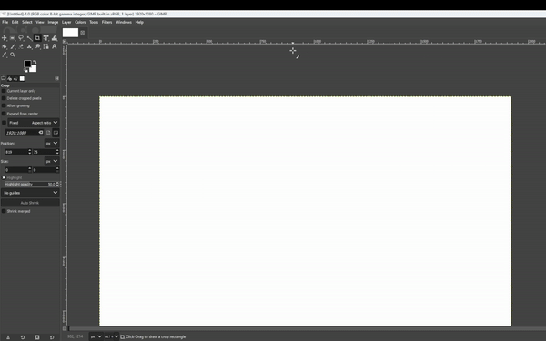
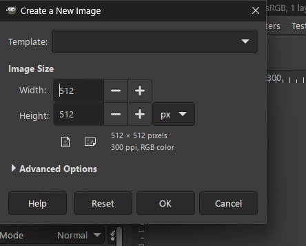
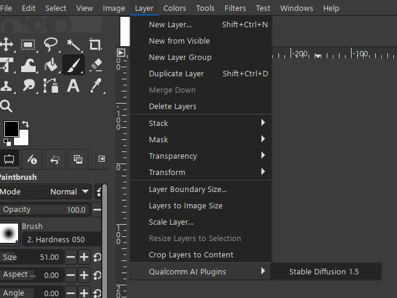
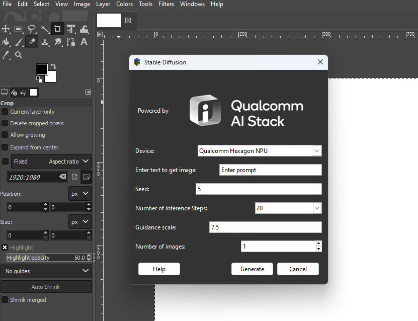

# Stable Diffusion plugin for GIMP  

The [Stable Diffusion](https://aihub.qualcomm.com/models/stable_diffusion_quantized) plugin for GIMP 2.99 allows users to generate images from text using stable diffusion 1.5. This plugin leverages Qualcomm NPU for faster inference time, providing efficient and high-quality image generation capabilities within the GIMP environment.

## Usage

1. Open GIMP 2.99
2. Create a new layer by clicking on `File` -> `New...` (Ctrl + N)

3. Create a new blank layer. 

4. Click on `Layer` -> `Qualcomm AI Plugins` -> `Stable Diffusion 1.5` from the dropdown menu. 

5. Stable Diffusion 1.5 dialog 

 
   - The device is by default selected as 'Qualcomm Hexagon NPU', where text encoder, unet, vae decoder run completely on NPU. 
   - Enter the prompt for which the image needs to be generated in the provided text box. For example: "A cat eating food on top of a table."

6. Click 'Generate' to start the process.
7. Wait for a few seconds and the generated image will appear on a new layer with dimensions 512 x 512.

## What's next?

- [Quick Installation](docs/install.md)
- [Build Instructions](docs/build.md)