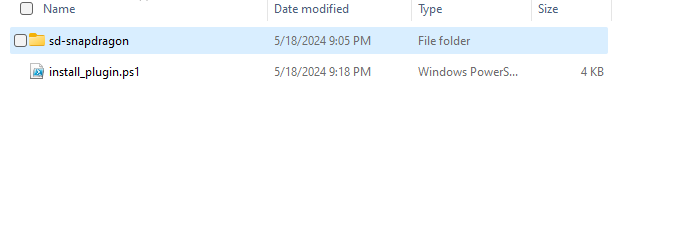

# Install plugin on Windows on Snapdragon

## 1. Install VC runtime
Install vc runtime on WOS from https://aka.ms/vs/17/release/vc_redist.arm64.exe

## 2. Install GIMP
Install GIMP 2.99 from https://download.gimp.org/gimp/v2.99/windows/gimp-2.99.18-setup.exe

This plugin is tested with GIMP 2.99.18.

## 3. Install plugin

Take the latest plugin release zip from the [releases page](https://github.com/quic/wos-ai-plugins/releases/tag/v1.3-gimp).
Unzip and run the `install_plugin.bat`  

 

This installer downloads required QNN libs, QNN quantized Stable Diffusion model and data files.

> **_NOTE:_**  At least 2.5GB of disk space is required for installing the plugin.

For usage instructions visit [overview and usage](../README.md)
