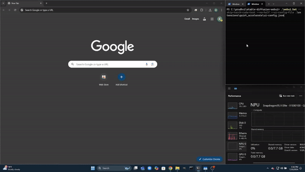

#  AUTOMATIC1111 stable-diffusion-webui Extension

Stable Diffusion WebUI can now be run on Qualcomm X-Elite NPU with [Qualcomm AI Runtime (QAIRT)](https://www.qualcomm.com/developer/software/qualcomm-ai-engine-direct-sdk). QAIRT support is provided through an custom extension script. The custom script uses QAIRT python APIs to run context binaries (.bin) generated by QAIRT SDK. We provide optimal performance by using QAIRT to run AI models on Qualcomm X-Elite NPU. These models are hosted on [Qualcomm AI hub](https://aihub.qualcomm.com/compute/models/stable_diffusion_v1_5_quantized?searchTerm=stable).


<sub><sup>This clip is at 2x speed</sup></sup>


> **_NOTE:_**  Majority of the AUTOMATIC1111's features are not supported by this extension as of now and the extension is in active development. New feature support will be added incrementally. We actively welcome feedback and contributions from the community.

## Supported features

* Original txt2img mode with SD 1.5 and 2.1
* Original img2img mode with ControlNet canny and Stable Diffusion 2.1 unclip model
* Sampling methods: [DPM++ 2M, Euler a, Euler, LMS, Heun, dpmsolver++, LMS Karras, DPM++ 2M Karras, dpmsolver++, DDIM, PLMS]
* Upscaling methods: ESRGAN-x4

## Instructions to run WebUI with QAIRT (Windows):

### Step 1: Install Dependencies
Download and install [git](https://github.com/git-for-windows/git/releases/download/v2.39.2.windows.1/Git-2.39.2-64-bit.exe) and [Python 3.10.6](https://www.python.org/ftp/python/3.10.6/python-3.10.6-amd64.exe)

> **_NOTE:_** The program is tested to work on Python `3.10.6`. Don't use other versions.

### Step 2: Download AUTOMATIC1111 stable-diffusion-webui
Run below commands in Windows PowerShell terminal.

```
git clone https://github.com/AUTOMATIC1111/stable-diffusion-webui.git
cd stable-diffusion-webui
```

### Step 3: Download Extension
Download `stable-diffusion-webui-qairt-extension.zip` from the [latest release](https://github.com/quic/wos-ai-plugins/releases/tag/v1.1-automatic1111-webui).
Unzip and place the `qairt_accelerate` extension under `stable-diffusion-webui\extensions`

### Step 4: Launch the WebUI

```
$env:TORCH_INDEX_URL="https://download.pytorch.org/whl/cpu"
$env:WEBUI_LAUNCH_LIVE_OUTPUT=1

.\webui.bat --skip-torch-cuda-test --no-half --precision full --ui-config-file .\extensions\qairt_accelerate\ui-config.json
```

The steps above will create a virtual environment and install the required packages into this environment.


## Troubleshooting

* To reinstall from scratch, delete directory: `venv`

Go-to: https://github.com/AUTOMATIC1111/stable-diffusion-webui/wiki/Troubleshooting